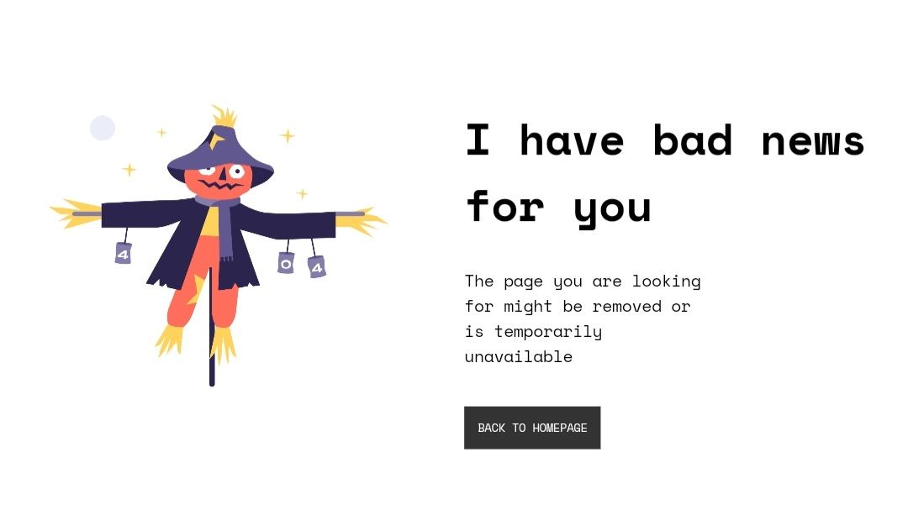
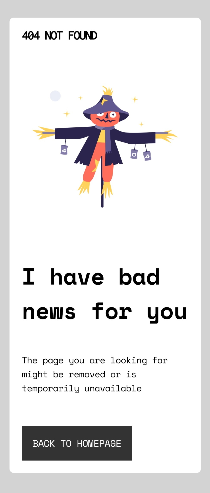

<h1 align="center">404-not-found</h1>

   Solution for a challenge from  <a href="http://devchallenges.io" target="_blank">Devchallenges.io</a>.

  <h3>
    <a href="https://github.com/neriaxel/404-not-found-challenge">
      Demo
    </a>
     | 
    <a href="https://github.com/neriaxel/404-not-found-challenge">
      Solution
    </a>
     | 
    <a href="https://devchallenges.io/challenges/wBunSb7FPrIepJZAg0sY">
      Challenge
    </a>
  </h3>

<!-- TABLE OF CONTENTS -->

## Table of Contents

- [Overview](#overview)
  - [Screenshot](#screenshot)
  - [Important Links](#important-links)
  - [Built With](#built-with)
- [Features](#features)
- [Contact](#contact)

<!-- OVERVIEW -->

## Overview

### Screenshot

### Important Links

- [Live site](https://neriaxel.github.io/404-not-found-challenge/)
- [Repository](https://github.com/neriaxel/404-not-found-challenge)

### Built With

<!-- This section should list any major frameworks that you built your project using. Here are a few examples.-->
- HTML 
- CSS
- Flex Box

## Features

<!-- List the features of your application or follow the template. Don't share the figma file here :) -->
- Responsive Design

This application/site was created as a submission to a [DevChallenges](https://devchallenges.io/challenges) challenge. The [challenge](https://devchallenges.io/challenges/wBunSb7FPrIepJZAg0sY) was to build an application to complete the given user stories.

## Contact

- [Github](https://github.com/neriaxel)
- [Linkedin](https://www.linkedin.com/in/neri-axel-barbona/)
